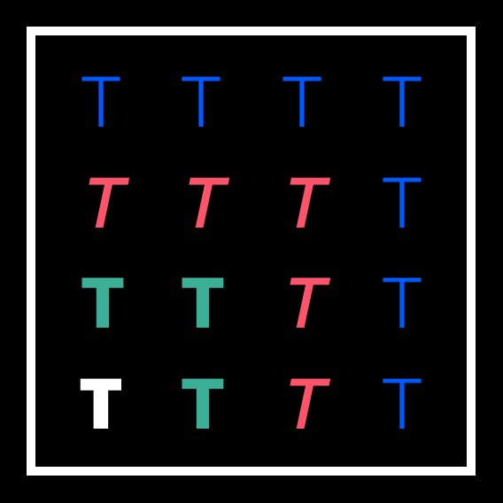

# Text to Styles

## What?

Generate all the Sketch text styles you have based on a config set up in your artboards. No more making and maintaining multiple variations! 

## Why?

If your text style system requires the use of different alignments or colour variations you are faced with either detaching styles, risking updates overwrite the tweaks you make or you manually have to create every style. 

This plugin aims to solve the generation and maintenance of Sketch text styles where you need colour and alignment variations of your text styles. 

## Installation

1. Download the [text-to-styles.zip](https://github.com/tbrasington/rename-layers-based-on-textstyle/raw/master/rename-layers-based-on-textstyle.zip)
2. Unzip
3. Double Click on `text-to-styles.sketchplugin` 

## Text Style naming convention
This is an opinioated plugin on how Text Styles should be named. The naming convention is:

`Style Name/Colour/Alignment/Breakpoint Varation`

The breakpoint variation is optional.

## Your Page setup

There is a sample project under sample/text-styles-sample.sketch to base your text and colour tokens off

You will need to set your Page structure and naming like this:

- Styles
- Colours
- Alignments

Please note that this is case sensitive! 

### Styles
Add your base text styles here. This plugin will pick up on:

- Font Family
- Font Size
- Line Height
- Character Spacing
- Text Transform (uppercase,lowercase)

#### Breakpoint adjustments
If you wish to add breakpoint adjustment for styles use the following naming syntax for the layer

`Style Name/Breakpoint Variation`

e.g. 

`Heading 1/BP1`

The plugin will then split the name and add the breakpoint to the end of the text style name

### Colours
Add shapes here with the colour value you want to render. The name of the layer defines the name in the Text Style palette. 
Order is done alphabetically.

### Alignments
Add your alignments here by setting each text layer to your preffered alignment.
Order is set Left, Center, Right. 

---

@tbrasington | tbrasington.com
